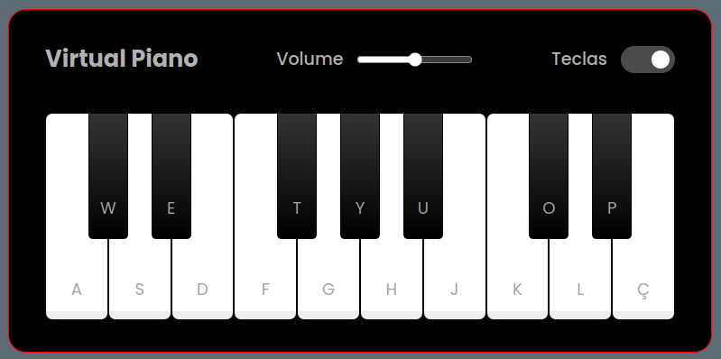

# Piano Virtual

## Descrição

Um aplicativo de piano virtual desenvolvido para fins didáticos, um desafio de projeto do bootcamp [Ri Happy - Front-end do zero,](!https://www.dio.me/bootcamp/coding-future-front-end-do-zero) em parceria com a [DIO](!https://www.dio.me/). Foi desenvolvido com HTML, JavaScript e CSS, permite aos usuários tocar notas de piano diretamente no navegador.



## Funcionalidades

- Teclas de piano interativas
- Sons reais de piano
- Suporte ao teclado do computador para tocar notas
- Feedback visual ao pressionar as teclas

## Instalação

1. Clone o repositório:
   ```bash
   git clone https://github.com/maxwelldeveloper7/piano_js_css.git
   ```
2. Abra o arquivo `index.html` no seu navegador

## Como Usar

Clique nas teclas do piano com o mouse ou use o teclado do computador para tocar notas.
